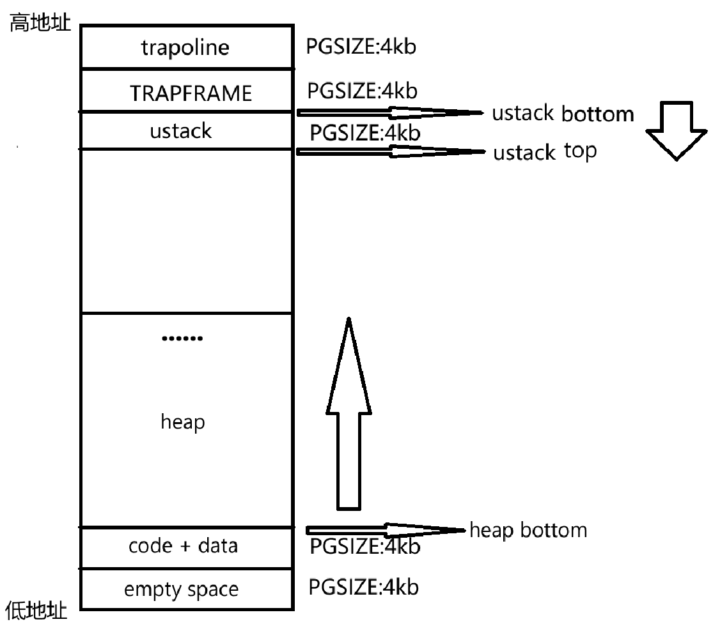

# 设计任务

在这次实验中，我们希望在整个OS当中引入进程这个概念，我们首先引入第一个用户进程，初始化它，一切就绪以后完成cpu的上下文切换，然后从内核态进入用户态，最后允许用户态使用系统调用，然后我们再处理这个系统调用，并最后依旧返回用户态

# 实验内容

## 内核页表添加映射

```c
// 完成 UART CLINT PLIC 内核代码区 内核数据区 可分配区域 trampoline 内核栈的映射
// 相当于填充kernel_pgtbl
void kvm_init()
{
    kernel_pgtbl=pmem_alloc(KERNEL);
    memset(kernel_pgtbl,0,PGSIZE);
    vm_mappages(kernel_pgtbl,UART_BASE,UART_BASE,PGSIZE,PTE_R|PTE_W);   
    vm_mappages(kernel_pgtbl,PLIC_BASE,PLIC_BASE,0x400000,PTE_R|PTE_W);   
    vm_mappages(kernel_pgtbl,CLINT_BASE,CLINT_BASE,0x10000,PTE_R|PTE_W);
    vm_mappages(kernel_pgtbl,KERNEL_BASE,KERNEL_BASE,(uint64)KERNEL_DATA-KERNEL_BASE,PTE_R|PTE_X);
    //这段区域放的是内核代码，所以要给它一个x位的权限，允许执行，但是不给w权限，防止内核代码被修改
    vm_mappages(kernel_pgtbl,(uint64)KERNEL_DATA,(uint64)KERNEL_DATA,(uint64)ALLOC_BEGIN-(uint64)KERNEL_DATA,PTE_R|PTE_W);
    //这段区域放的是数据段和bss段
    vm_mappages(kernel_pgtbl,(uint64)ALLOC_BEGIN,(uint64)ALLOC_BEGIN,(uint64)ALLOC_END-(uint64)ALLOC_BEGIN,PTE_R|PTE_W);
    //trampoline的物理页在内核初始化的时候就分配好
    vm_mappages(kernel_pgtbl,TRAMPOLINE,(uint64)trampoline,PGSIZE,PTE_R|PTE_X);
    //映射内核栈
    kp_map_stacks();
}
```

### trampoline映射

因为我们引入了用户进程，所以我们需要映射trampoline这个物理页在内核页表上
trampoline里面包含了用户态和内核态切换时需要的代码和数据结构，所以当我们需要引入用户进程的时候，就必须在内核页表中添加trampoline的映射了，它被放在了页表地址的最高处，大小位一个PGSIZE

### 内核栈映射

我们的每个进程在内核页表中都有一个部分是内核栈，它们需要在内核页表初始化的时候就映射好，然后后续再将其页表中的地址放到进程的内核栈地址存储变量里
但是在我们当前的 `kvm_init()`函数里面只需要完成映射内核栈即可

## 初始化第一个用户进程

```c
// 第一个进程
static proc_t proczero;

// 获得一个初始化过的用户页表
// 完成了trapframe 和 trampoline 的映射
pgtbl_t proc_pgtbl_init(uint64 trapframe)
{
    pgtbl_t proc_pgtbl=pmem_alloc(USER);
    vm_mappages(proc_pgtbl,TRAMPOLINE,(uint64)trampoline,PGSIZE,PTE_R|PTE_X);
    vm_mappages(proc_pgtbl,TRAPFRAME,trapframe,PGSIZE,PTE_R|PTE_W);
    return proc_pgtbl;
}

void proc_make_first()
{
    //uint64 page;
    proczero.tf=(trapframe_t*)pmem_alloc(USER);
    // pid 设置
    proczero.pid=0;

    // pagetable 初始化
    proczero.pgtbl=proc_pgtbl_init((uint64)proczero.tf);

    // ustack 映射 + 设置 ustack_pages 
    vm_mappages(proczero.pgtbl,USTACK_BOTTOM-PGSIZE,(uint64)pmem_alloc(USER),PGSIZE,PTE_R|PTE_W|PTE_U);
    proczero.ustack_pages=1;

    // data + code 映射
    assert(initcode_len <= PGSIZE, "proc_make_first: initcode too big\n");
    char* addr;
    addr=pmem_alloc(USER);
    vm_mappages(proczero.pgtbl,DATA_CODE_START,(uint64)addr,PGSIZE,PTE_U|PTE_R|PTE_W|PTE_X);
    memmove(addr,initcode,initcode_len);

    // 设置 heap_top
    // 此时堆为空的，所以堆底就是堆顶
    proczero.heap_top=HEAP_BOTTOM;

    // tf字段设置
    proczero.tf->epc=DATA_CODE_START;
    proczero.tf->sp=USTACK_BOTTOM;
    // 内核字段设置
    proczero.kstack=KSTACK(proczero.pid);
    proczero.ctx.sp=KSTACK(proczero.pid)+PGSIZE;
    proczero.ctx.ra=(uint64)trap_user_return;
    // 上下文切换
    cpu_t* cpu=mycpu();
    cpu->proc=&proczero;
    swtch(&(cpu->ctx),&(proczero.ctx));

```

### 需要初始化的内容

### 用户页表的地址安排



我们特别关注用户栈和堆区
栈底和堆底都是保持不动的，属于起始位置，栈底在高地址，随着放入内容堆顶向低地址减少，但是这里我们给内核栈只分配了一页，堆区则是堆底在低地址，随着内容增加，堆顶向高地址增加

### 映射

我们要在初始化中完成代码和数据段的映射，trampoline和trapframe的映射，用户栈的映射
在此要特别关注每个映射的权限

#### 权限

- code+data：X，R，W，U（因为这个区域有代码需要执行，有数据需要读写）
- ustack：R，W，U
- TRAPFRAME：R，W
- trampoline：R，X（管理内核态和用户态切换代码，可读不能修改需要可执行）

### 初始化字段和寄存器

#### context上下文

context是不同进程在内核态切换时的暂存区

```c
    proczero.ctx.sp=KSTACK(proczero.pid)+PGSIZE;
    proczero.ctx.ra=(uint64)trap_user_return;
```

sp寄存器放内核栈的起始地址
ra寄存器放陷入程序的地址

#### trapframe

trapframe是内核态和用户态之间切换时的暂存区

```c
    proczero.tf->epc=DATA_CODE_START;
    proczero.tf->sp=USTACK_BOTTOM;
```

epc放数据段和代码段的地址
sp放用户栈的栈底地址

### 上下文切换

```c
    proczero.ctx.sp=KSTACK(proczero.pid)+PGSIZE;
    proczero.ctx.ra=(uint64)trap_user_return;  

    cpu_t* cpu=mycpu();
    cpu->proc=proczero;
    swtch(&cpu->ctx,&proczero.ctx);
```

context的作用：在内核态下出现进程切换的的时候，记录进程目前的各种状态

在这里我们cpu目前持有的进程是一个执行当前代码的进程，我们创建了一个新的进程，我们希望在此处切换到这个创建的新进程，但是新进程的上下文毫无内容，所以此时此刻我们要初始化新进程的两个上下文关键内容

sp：指向内核栈栈底    ra：普通的函数调用结束以后的返回地址

完成这两个的初始化以后,接着让当前的cpu明面上持有新进程，然后再通过swtch汇编代码段实现上下文切换，这段代码的操作一部分是要将被切换进程的寄存器内容写进它的context，然后再将新进程的context真正写进寄存器

此时此刻，ra寄存器已经存下了这段汇编函数的返回地址，即trap_user_return，这段函数结束后就会通过ret指令返回到ra记录的地址处

为什么用ret不用sret？区分ret和sret操作

ret：ret操作是应对普通的函数调用后的返回地址，不涉及到模式切换，它会在被调用以后跳转到ra寄存器存储的地方

sret：sret操作是希望在Smode下实现模式切换。切换到什么模式？：由sstatus寄存器的spp字段决定。切换到什么地址开始指向代码？：由sepc寄存器记录的地址决定

目前我们位于Smode还不需要切换模式，我们只是希望切换进程之后依旧留在Smode执行trap_user_return函数。在trap_user_return函数中，我们才会真正地从内核态到用户态，从Smode到Umode

## 0号进程从内核态进入用户态

此时，cpu已经在运行我们的0号进程了，但是我们还需要进入用户态来执行用户态的代码，trap_user_return就是在做这样的事情，由于是涉及到了内核态和用户态的切换，所以这段函数的关注点就要集中在trapframe的初始化上了，因为trapframe就是负责在内核态和用户态之间切换时的暂存区

```c
    w_stvec(TRAMPOLINE+(user_vector-trampoline));
```

stvec寄存器：用于存储发生trap时候的返回地址，因为我们马上要进入用户态，所以我们要把这个trap处理地址从kernel_vector（这个是在trap_kernel_inithart函数里面写好的）换成user_vector，但是我们目前不是依旧还在内核态么，如果此时此刻发生trap难道要进入用户态的trap处理程序？当然不行，所以我们要在修改stvec之前关闭中断，防止出现我们刚刚假设的意外情况

初始化trapframe

```c
    p->tf->kernel_satp = r_satp();   
    p->tf->kernel_sp = p->kstack + PGSIZE; // 指向内核栈顶
    p->tf->kernel_trap = (uint64)trap_user_handler;//
    p->tf->kernel_hartid = r_tp();   
```

回想在proc_make_first函数当中，我们已经初始化了两个值（epc：指向返回用户态后的代码地址 和sp：指向用户栈），那为什么不放到这里来一起初始化呢？因为trap_user_return函数是公用的，但是epc和sp寄存器的初始化有一定定制性

初始化sstatus

```c
    unsigned long x = r_sstatus();
    x &= ~SSTATUS_SPP; // sret后进入Umode
    x |= SSTATUS_SPIE; // 在Umode中允许中断
    w_sstatus(x);
```

在一会儿Smode下调用sret后要切换模式了，sstatus要提前指定好是要返回到哪个模式，以及在新模式下的中断权限

```c
    //sret指令执行的最直接效果是将程序计数器设置成SEPC寄存器的值
    //所以现在我们将SEPC寄存器的值设置成之前在trapframe中保存的用户程序计数器的值
    w_sepc(p->tf->epc);
    //写好satp这个参数，未来将作为参数传入user_return这段汇编里面，然后写入satp寄存器
    uint64 satp = MAKE_SATP(p->pgtbl);
    //fn是user_return的虚拟地址
    uint64 fn = TRAMPOLINE + (user_return - trampoline);
    //进入user_return汇编
    ((void (*)(uint64,uint64))fn)(TRAPFRAME, satp);
```

sret后不仅要根据sstatus决定切换后的模式，也要根据sepc确定返回后的执行地址，这个地址在最开始的时候就被写在了trapframe里，现在cpu正式持有这个进程后，我们就可以把它正式从暂存区trapframe写入寄存器了，最后我们再取出satp，然后调用存在trampoline中，返回用户态的汇编代码了，我们把一切最后工作都交给这个user_return 汇编代码了，在汇编代码结束后，它会调用sret，正式进入用户态了

## 用户态的trap处理函数

进入trap_user_handler函数就意味着进入了内核态，这个时候需要马上写stvec来将trap处理汇编函数的地址从user_vector修改为kernel_vector

然后根据不同的scause，调用不同的trap处理函数

最后调用trap_user_return函数来回到用户态
